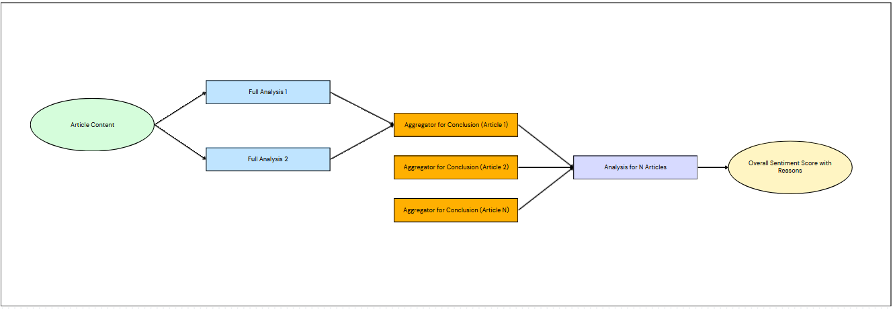

# Stock and News Analysis: A Mixture-of-Agents Approach
This is a web application that combines stock data analysis with news sentiment evaluation using a mixture-of-agents approach, providing insights regarding a chosen stock. If you are lazy to set this up yourself, feel free to visit [here](https://stock-news-analysis.streamlit.app/) to explore the web application hosted using Streamlit. 

## Inspiration

It all began with an intriguing article: [Unleashing the Power of Collective Intelligence: The Mixture-of-Agents Approach in Large Language Models and Together&#46;ai](https://blog.stackademic.com/unleashing-the-power-of-collective-intelligence-the-mixture-of-agents-approach-in-large-language-330b4ae5eadf). As I delved into the concepts presented, I had this crazy idea - What if I could apply this technique to create something interesting, like sentiment analysis?

## The Birth of an Idea

But sentiment analysis of what? Driven by curiosity and passion for data visualization and web scraping, I set out to create a web application that would allow me to do that. That was when I had my idea: combine stock data analysis with news sentiment evaluation using a mixture-of-agents approach. The result? A tool that would generate insights in the complex world of investments.

## The Journey Begins

### Key Features

With excitement, I began mapping out the core features of my application:

- Stock data visualization that brings numbers to life
- Technical analysis with various indicators 
- News sentiment analysis using a mixture of agents approach, bringing a new dimension to analysis
- Interactive charts and metrics for easy interpretation

### Initial Idea
Initially, I came up with 4 agents per article. They would be responsible for sentiment analysis, key points summary, bias detection, and last but not least, an aggregator to consolidate the information from the first three agents.

### Challenges

#### Challenge 1
As with any project, I encountered my fair share of obstacles. My initial approach using Ollama for local LLM analysis proved to be a bottleneck. Processing 10 articles with 4 queries each was taking an eternity...! But then, after looking into other alternatives, I discovered Groq.

Groq's high-speed inference capabilities opened up new possibilities. However, I quickly learned that even the most powerful tools have their limits. API call restrictions and token count limitations forced me to rethink my strategy.

#### Challenge 2
My app relies on parsing a JSON object to display it properly on the frontend. However, some of the inputs parsed comes from the output of the LLMs directly. Despite and explicit prompt injection for it to output a JSON formatted response, it failed to output a JSON object reliably.

### Adapting and Evolving

#### Solution 1
Undeterred, I pivoted. Instead of using 4 different agents per article, I devised a new approach:

1. Two agents, each using a different model, would run a full analysis on each article.
2. An aggregator/combinator agent would process the output of these two models to produce a final analysis.

While this new architecture had its own set of limitations, it allowed me to work within the constraints of the API while still achieving my goal of learning and creating a functional prototype.

#### Solution 2
To ensure that the response is in a proper JSON format, I have set up another agent that acts as a JSON formatter to ensure the output will be in an acceptable format. However, taking into account the API key limits, the agent would be utilized only in the except block when I try to convert the response into a JSON object, and would try a maximum of 3 times before returning None.

### New Idea

## Installation and Usage
### Installation

To embark on this journey yourself, follow these steps:

1. Clone the repository:

`git clone https://github.com/neozhijie/stock-news-analysis.git cd stock-news-analysis`

2. Create a virtual environment (optional but recommended):

`python -m venv venv` 
`source venv/bin/activate`
 `# On Windows, use venv\Scripts\activate`

3. Install the required dependencies:

`pip install -r requirements.txt`

4. Set up your [Groq API key](https://console.groq.com/keys) in a `.env` file:

`GROQ_API_KEY=your_groq_api_key_here`

### Usage

To experience the Stock and News Analysis Page:

1. Ensure you're in the project directory with your virtual environment activated.
2. Launch the Streamlit app:

`streamlit run interface.py`

3. Open your web browser and navigate to the provided URL (usually `http://localhost:8501`).
4. Enter a stock ticker symbol, click "Analyze", and explore the wealth of information at your fingertips!

## Limitations and Challenges

As with any journey of discovery, this project has its limitations:

- Occasional hallucinations in analysis
- Performance variations based on data volume and API response times
- Limited news sources and potential extraction failures
- API call limits (adjustable in `tools/news_scraper.py`)
- Accuracy of analysis (take it with a pinch of salt!)
